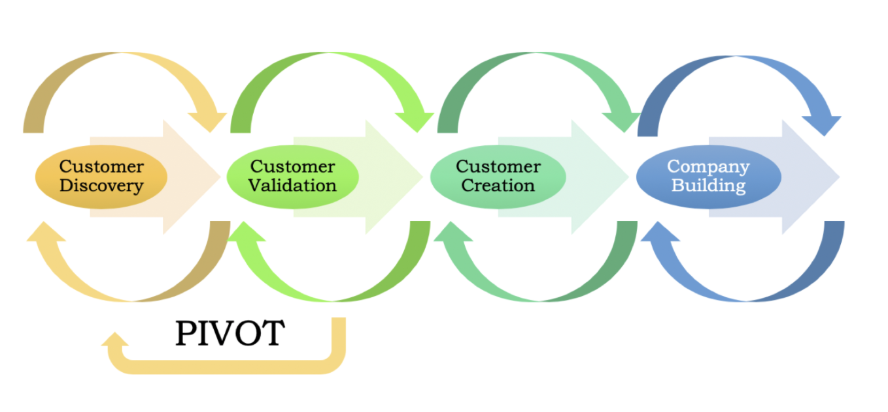
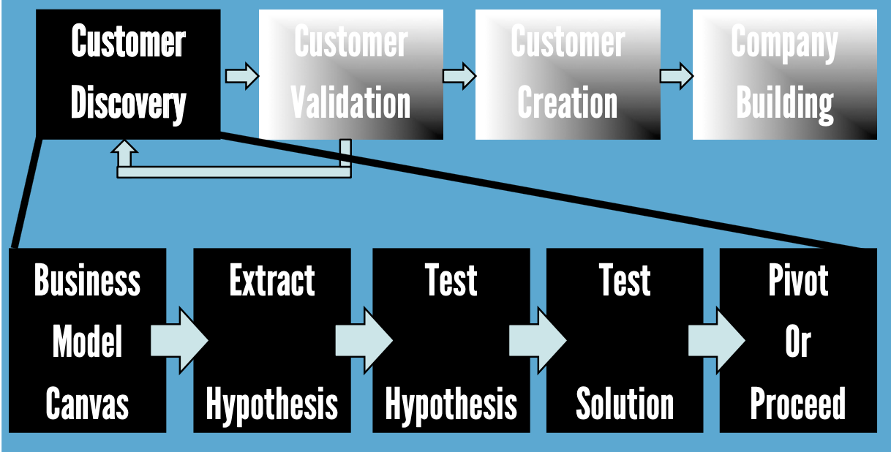
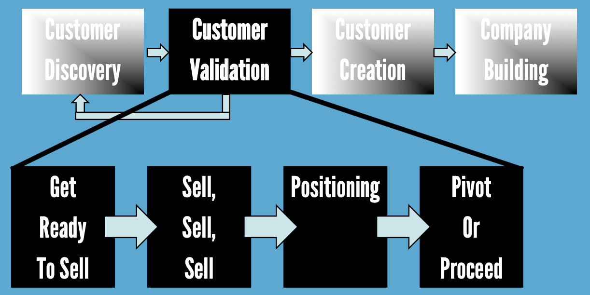

## Customer Development   Principles and Tactics  for Startups

Mark Koester | www.markwk.com  
Startup Boost, April 28, 2020  
Slides and References: github.com/markwk/customer-dev-talk

# Slides: 

github.com/markwk/customer-dev-talk

#

> The core of Customer Development is blissfully simple: Products developed by founders who get out in front of customers early and often, win. 
>
> <small>Steve Blank</small>

# Agenda

- About Me
- Key Concepts
- Example / Story
- Principles
- Tactics
- Resources

# About Me

Mark Koester

- I'm a "Startup Generalist" who focuses on customers and product. 
- Technical Consultant and PM @ Int3c.com
- Former: Regional Development (Greater China) at Techstars and Up Global (acquired)
- Blog: www.markwk.com | Products: www.markwk.com/products | Biz: Int3c.com | Code: github.com/markwk

# Key Concepts

(or my own assumptions for what we are taking about) 

---

### Startup

> a series of untested hypothesis and assumptions

::: notes

Put another way: **Startups / founders / entrepreneurs exist to deal with uncertainty**. 

Steve Blank and other have shown that traditional business management processes and planning developed in MBA programs are not suited for startups, because startups operate in uncertainy. 

>  A startup is a temporary organization in search of a scalable, repeatable, profitable business model. (Blank, 2012)

> In sharp contrast, startups operate in “search” mode, seeking a repeatable and profitable business model. The search for a business model requires dramatically different rules, roadmaps, skill sets, and tools in order to minimize risk and optimize chances for success. (Blank, 2012)

SEE: Blank, S. G., & Dorf, B. (2012). The Startup Owner’s Manual.
:::

-------

### Customer Development

> a process to organize the search for a business model, find product-market fit, understand your customers, etc.

 

<small>Originated with Steve Blank and popularized by Eric Reis and Lean Startup. Dovetails well with many aspects of UX. </small> 

::: notes

Steve Blank and others strive to make this an almost scientific process but it still very much an art rather than a purely empirical science. 

:::

-------

### Two Phases of Customer Development

1. Customer discovery = "acquiring a deep understanding of customer needs"
2. Customer validation = process to invalidate/prove other aspects of your biz model like sales desire and traction channels

-------

### Pivot

- Change in one of more business model components

 

<small>Eric Ries / Lean Startup: a "structured course correction designed to test a new fundamental hypothesis about the product, strategy, and engine of growth."</small>

::: notes
:::

-------

### 

> In practice, startups begin with a set of initial hypotheses (guesses), most of which will end up being wrong. Therefore, focusing on execution and delivering a product or service based on those initial, untested hypotheses is a going-out-of-business strategy. 
>
> <small>Steve Blank</small>

= Overemphasis on deliverables and product, underemphesis on users and customers.

::: notes

Overemphasis on deliverables and product

Startups and entrepeneurs tend to focus on what we build, do and deliver and forget to spend as much time, energy and thought on customer discovery. 

:::

-------

### Objective of Customer Development

Turn assumptions and guesses into facts and knowledge ASAP. 

::: notes

Best combined with agile product development 

::: 

-------

### How-To Customer Development = 

Talk to customers. 

# Example

- Finding, Understanding and Selling Sponsorship Customers for Up Global and Techstars in China (2014-2016)
- Assumptions from US
- What I Did
- Discoveries / Lessons Learned

::: notes

- Finding, Understanding and Selling Sponsorship Customers for Up Global and Techstars in China (2014-2016)
- Assumptions from US: We need a lot of events to get sponsorship, i.e. event volume drives sponsorship.
- Talked to nearly all of the existing, past and potential sponsors. 
- Discovered we weren't fulfilling various sponsorship needs for Chinese Market. 
- Lessons Learned: Sponsorship match/alignment was more important than volume and consistent business development could unlock $$$. 

:::

# Principles

### Markets with...

- Invention / Technology Risk (questionable if tech can be done or invented).
- Customer/Market Risk (unknown if customers will adopt and/or pay product/service)

### Customer Development Process

{ width=80%}

### Customer Discovery Process

{ width=80%}

### Customer Validation Process

{ width=80%}

###

The <u>key</u> to customer discovery...

<h1>TALKING</h1>

to customers

###

By understanding the <u>problem</u>, you can...

<h2>Understand the solution.</h2>

# Tactics

### Own your assumptions. 

- What are your assumptions that, if invalidated, will break the business? 
- Business Model Canvas = use to lay out your key assumptions to test
- Market Sizing = talk to customers from your target markets, use to explore definition of markets (overall, addressable and target)

### Get out of the Building.

### Focus on learning and helping, rather than selling

### Customer Interview

1. Person
2. Problem 
3. Solution

### MVP House

{ width=80%}

### 1. The Person

- Who are they? What is their role?  Backgound? Etc.
- If business product, who is their boss? who works for them? 
- What is a typical day like? How do they spend their time? 

<u>Goal: Get a broad background understanding of the person. Develop a relationship. Stay broad.</u> 

### 2. The Problem

- Learn about the problems that person recognizes and verbalizes.
- What are the top three challenges they face? 
- What is frustrating, expensive or time consuming? 
- What would they change right now? 
- How are they solving them? Competitors? DIY tools and workarounds? 

<u>Goal: Get them to verbalize the problem you want to solve (preferrably unprompted)</u>

### 3. The Solution

- Assuming you've gotten them to identify with your problem, then... 
- Reveal your solution (either as a concept or prototype or product)
- Read their reactions as well as their words to capturee their level of interest. 
- HINT: "That's interesting" = kiss of death

<u>Goal: Discover if they want your solution and gather feedback.</u> 

### Tips for Customer Interviews (1)

- Turn assumptions into customer questions. 
- Create a script of your key questions. 
- Work as team (customer development is the job of entire founding team). 
- Take detailed notes (and consider recording)
- Use a Google form to log key responses. 
- Be empathetic with interviewee and go off script when needed. 
- <u>If they are excited about something, ask if they'll pay for</u>. 

### Tips for Customer Interviews (2)

- Be open-ended. 
- Show them early prototypes (if you have them and if they indicated a desire for it). 
- Always follow-up.
- End with an ask (intro to someone else to interview, join mailing list, etc.).
- Review and Summarize, esp Extract key quotes and look for patterns and clusters 
- <u>Be open to new problems and opportunities.</u> 

### Iterate: Focus or Pivot. 

{ width=80%}

### Where to find people/prospects to interview? 

- Tap your social and professional network 
  - LinkedIn, Email, contacts, etc.
  - Expect a higher response (30-40%)
- Meetup Groups, Twitter, Facebook Groups, Reddit, Craigslist, Instagram, etc. 
  - Expect a lower response rate (10-20%)
  - Consider offering payment/gift card for an interview

### How Many Interviews?

- As many as needed to in/validate assmptions. 
- DISCOVERY TIP: <u>Aim to do 8-10 interviews for each customer type</u>
- UX TIP: Customer Discovery can be combined with and supplement user testing. 

### Debrief, Review and Summarize

### Keep a *Living* "Customer Research" report

### Track your assumptions...

- Google Doc / Spreadsheet / Airtable of all assumptions and hypotheses to validate and test. 
- Record the status.
- Rank their importance (i.e. if invalidated, does it invalidate entire business?)
- Link to interviews you do and experiments you run. 

TIP: Validation Board from Lean Startup Machine. 

### Run Lean startup / marketplace experiments

- When in doubt, don't assume. Instead, test it! 
- Examples:
  - Value hypothesis test = sell to target customers 
  - Growth hypothesis test = experiment with traction methods

### Customer development is about more than the customer. 

- It's about exploring the dimensions of your business model and ecosystem in an inexpensive, agile and opportunistic way. 

- It's about testing the validity of your most important assumptions. 
- It's about dealing with your uncertainties. 

# Summary

- All startups face uncertainties. Own your assumptions. 
- Turn assumptions and guesses into facts and knowledge ASAP. 
- Get out of the building (or into a zoom call!) and talk to customers. 
- Customer Development is intended as a systematic process towards dealing with uncertainty and reaching product-market fit (i.e. products that matter, sell and that VC want to invest in). 

#

> No campaign plan survives first contact with the enemy - Field Marshall Helmuth Graf von Moltke

>  No Plan Survives First Contact With Customers - Steve Blank

# Resources / References

### Resources and Book Recommendations

- Steve Blank & Bob Dorf - Startup Owners Manual (2012)
- https://steveblank.com/tools-and-blogs-for-entrepreneurs/
- Dan Shapiro - Hot Seat (2015). 
- David Rose - The Startup Checklist. (2016).
- Gabriel Weinberg - Traction: How Any Startup Can Achieve Explosive Customer Growth
- Blog www.markwk.com 
- Slides: github.com/markwk.com/customer-dev-talk

### Additional References

- Bygrave, W. D., Lange, J., Mollov, A., Pearlmutter, M., & Singh, S. (2007). Pre-startup formal business plans and post-startup performance: a study of 116 new ventures. Venture Capital Journal, 9(4), 1-20.
- Chesbrough, H., & Rosenbloom, R. S. (2002). The role of the business model in capturing value from innovation: evidence from Xerox Corporation’s technology spin‐off companies. Industrial and corporate change, 11(3), 529-555.

# Thanks

#

Find me online at www.markwk.com!